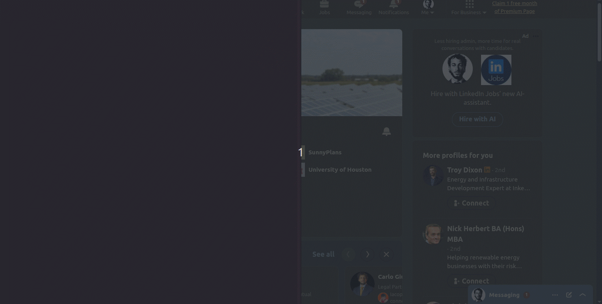

> **The open-source growth engine that puts your LinkedIn B2B lead generation on autopilot.**

<div align="center">

### See it in action!



<br/>

[](https://github.com/eracle/OpenOutreach/stargazers)
[](https://github.com/eracle/OpenOutreach/network/members)
[](https://www.gnu.org/licenses/gpl-3.0)
[](https://github.com/eracle/OpenOutreach/issues)
[](http://makeapullrequest.com)

</div>

---

<div align="center">

## 🚀 Quick Start

Get up and running in minutes:

```bash
git clone https://github.com/eracle/OpenOutreach.git
cd OpenOutreach
make up
```

</div>

---

## 📚 Table of Contents

- [Features](#-features)
- [Installation](#-installation)
- [Usage](#-usage)
- [Visual Debugging](#-visual-debugging)
- [Project Structure](#-project-structure)
- [Configuration](#-configuration)
- [Community](#-community)
- [License](#-license)
- [Legal Disclaimer](#-legal-disclaimer)

---

## ✨ Features

| Feature                            | Description                                                                                                          |
|------------------------------------|----------------------------------------------------------------------------------------------------------------------|
| 🤖 **Advanced Browser Automation** | Powered by Playwright with stealth plugins for human-like, undetectable interactions.                                |
| 🛡️ **Reliable Data Scraping**     | Uses LinkedIn's internal Voyager API for accurate, structured profile data (no fragile HTML parsing).                |
| 🐍 **Python-Native Campaigns**     | Write flexible, powerful automation sequences directly in Python.                                                    |
| 🔄 **Stateful Workflow Engine**    | Tracks profile states (`DISCOVERED` → `ENRICHED` → `CONNECTED` → `COMPLETED`) in a local DB – resumable at any time. |
| 💾 **Persistent Local Database**   | Full data ownership via dedicated SQLite DB per account.                                                             |
| 🐳 **Containerized Setup**         | One-command Docker + Make deployment.                                                                                |
| 🖥️ **Visual Debugging**           | Real-time browser view via built-in VNC server (`localhost:5900`).                                                   |
| ✍️ **AI-Ready Templating**         | Jinja or AI-prompt templates for hyper-personalized messages (easy GPT integration).                                 |

---

## 🛠️ Installation

### Prerequisites

- [Make](https://www.gnu.org/software/make/)
- [Docker](https://www.docker.com/)
- [Docker Compose](https://docs.docker.com/compose/)
- [Git](https://git-scm.com/)

### Steps

1. **Clone the repository**
   ```bash
   git clone https://github.com/eracle/OpenOutreach.git
   cd OpenOutreach
   ```

2. **Configure LinkedIn accounts**
   ```bash
   cp assets/accounts.secrets.template.yaml assets/accounts.secrets.yaml
   ```
   Edit `assets/accounts.secrets.yaml` and add your credentials (multiple accounts supported).

3. **Add target profiles**
   Add LinkedIn profile URLs to `assets/inputs/urls.csv`.

4. **Build & run**
   ```bash
   make up
   ```
   The tool will select the first active account and begin processing.

---

## 📖 Usage

The default **Connect and Follow-Up Campaign** (`linkedin/campaigns/connect_follow_up.py`) automates:

- Profile enrichment via Voyager API
- Sending connection requests
- Personalized follow-up messages after acceptance

**Profile states:**

- `DISCOVERED` → `ENRICHED` → `CONNECTED` → `COMPLETED` (or `FAILED`)

The system is fully resumable – stop and restart without losing progress.

Customize campaign logic and message templates directly in the Python campaign file.

---

## 🖥️ Visual Debugging

Watch the browser automation live:

1. Install a VNC viewer (e.g., on Ubuntu: `sudo apt install vinagre`)
2. Build containers: `make build`
3. Run in view mode: `make up-view`
4. Connect to `localhost:5900` with your VNC client (password: `secret`)

---

## 📂 Project Structure

```
├── assets/
│   ├── accounts.secrets.yaml      # Your LinkedIn credentials
│   └── inputs/
│       └── urls.csv               # Target profile URLs
├── linkedin/
│   ├── actions/                   # Low-level browser actions
│   ├── api/                       # Voyager API client
│   ├── campaigns/                 # Automation workflows
│   ├── db/                        # SQLite models & utilities
│   ├── navigation/                # Login & navigation helpers
│   └── sessions/                  # Account session management
├── main.py                        # Application entry point
├── local.yml                      # Docker Compose config
└── Makefile                       # Build/run shortcuts
```

---

## ⚙️ Configuration

- `assets/accounts.secrets.yaml` – Add accounts and set `active: true`
- `assets/inputs/urls.csv` – List of target LinkedIn profile URLs
- Campaign file – Edit templates (Jinja or AI-prompt) and workflow logic

---

## 💬 Community

Join the discussion and get support:  
[Telegram Group](https://t.me/+Y5bh9Vg8UVg5ODU0)

---

## ⚖️ License

Licensed under the [GNU GPLv3](https://www.gnu.org/licenses/gpl-3.0) – see [LICENCE.md](LICENCE.md) for details.

---

## 📜 Legal Disclaimer

This project is **not affiliated with, endorsed by, or sponsored by LinkedIn**.

Use of automation tools may violate LinkedIn's User Agreement (Section 8.2). LinkedIn may suspend or terminate accounts
detected using such tools. The authors and contributors assume no liability for any consequences resulting from its use.

**Use entirely at your own risk.**

---

<div align="center">

**Made with ❤️ by the open-source community**

</div>
