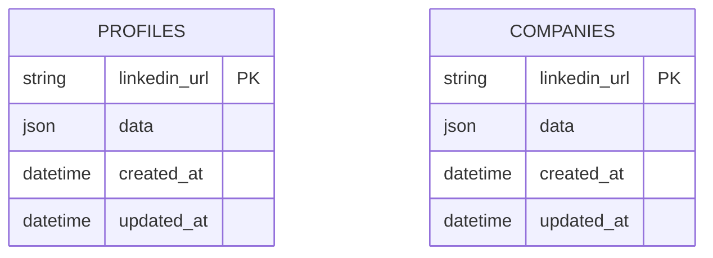
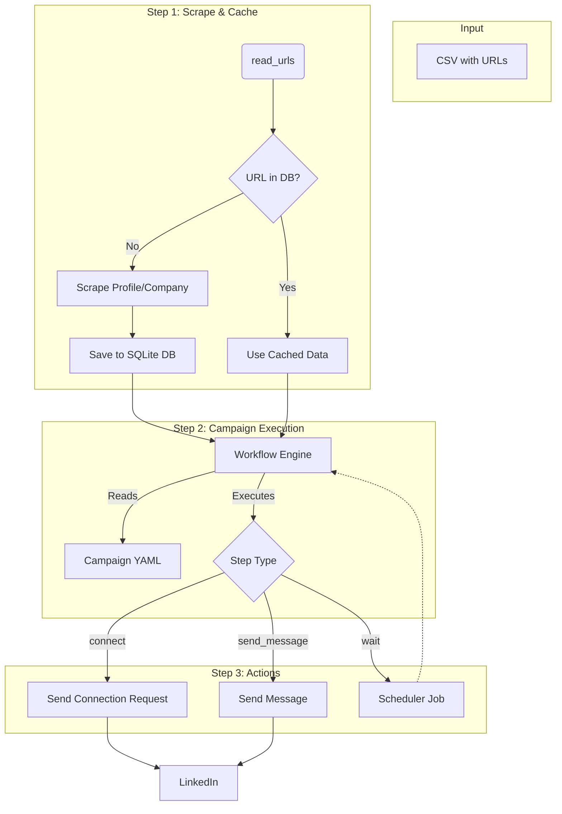

# System Architecture

This document outlines the architecture of the LinkedIn automation tool, from data ingestion and storage to the workflow
execution engine.

## High-Level Overview

The system is designed to automate interactions on LinkedIn based on configurable campaigns. The core workflow is as
follows:

1. **Input**: LinkedIn profile or company URLs are provided via CSV files.
2. **Data Caching**: The system scrapes detailed information for each URL and stores it in a local SQLite database (
   `linkedin.db`). This database acts as a cache to avoid redundant scraping.
3. **Campaign Execution**: A workflow engine reads campaign definitions from YAML files and executes a sequence of
   steps (e.g., send connection request, send message) for each entity.
4. **Scheduling & State**: An `APScheduler` instance manages the timing of actions and tracks the state of long-running
   workflows (e.g., waiting for a connection request to be accepted), using the same `linkedin.db` database.

## Core Entities

The system revolves around two primary data models: `Profile` and `Company`. These will be implemented as Pydantic
models for data validation and structured storage.

### Profile

A `Profile` represents a LinkedIn user. The schema is based on the data retrieved from the LinkedIn API.

```python
# (in linkedin/models.py)
from pydantic import BaseModel
from typing import List, Dict, Any


class Profile(BaseModel):
    linkedin_url: str  # Primary Key
    public_id: str
    profile_id: int
    first_name: str
    last_name: str
    headline: str
    summary: str
    country: str
    city: str
    experience: List[Dict[str, Any]]
    education: List[Dict[str, Any]]
    skills: List[str]
    # ... and other fields from the API
```

### Company

A `Company` represents a LinkedIn company page. The schema is based on the data retrieved from the LinkedIn API.

```python
# (in linkedin/models.py)
class Company(BaseModel):
    linkedin_url: str  # Primary Key
    name: str
    tagline: str
    about: str
    website: str
    industry: str
    company_size: str
    headquarters: Dict[str, str]
    # ... and other fields from the API
```

## Database

The application uses a single SQLite database file, `linkedin.db`, for all its persistence needs. This includes:

- **Data Cache**: Tables for `profiles` and `companies`.
- **Job Scheduling**: Tables used by `APScheduler` to manage jobs.

### Database Schema

The cache tables are defined as follows:

**`profiles` table**
| Column | Type | Description |
| :--- | :--- | :--- |
| `linkedin_url` | TEXT | PRIMARY KEY. The full LinkedIn profile URL. |
| `data` | JSON | A JSON object containing the scraped profile data. |
| `created_at` | DATETIME | Timestamp of when the record was created. |
| `updated_at` | DATETIME | Timestamp of when the record was last updated. |

**`companies` table**
| Column | Type | Description |
| :--- | :--- | :--- |
| `linkedin_url` | TEXT | PRIMARY KEY. The full LinkedIn company URL. |
| `data` | JSON | A JSON object containing the scraped company data. |
| `created_at` | DATETIME | Timestamp of when the record was created. |
| `updated_at` | DATETIME | Timestamp of when the record was last updated. |

## Diagrams

### Entity-Relationship Diagram

This diagram shows the relationship between the core entities and the database tables.



### Data Flow Diagram

This diagram illustrates the flow of data through the system, from input to action.



## Workflow Engine

The workflow engine drives the automation.

- **Campaigns**: Defined in YAML files in `assets/campaigns/`. A campaign is a sequence of steps.
- **Steps**: Each step is a specific action (`connect`, `send_message`) or a condition (`wait_for_connection`).
- **Data Handling**: Instead of passing a state dictionary between steps, the engine relies on the SQLite database as
  the single source of truth. Each step queries the database for the information it needs. This logic is centralized in
  a dedicated `linkedin/database.py` module.
- **Scheduling**: For long-running waits, the engine schedules jobs with `APScheduler`, which polls for conditions (
  e.g., connection accepted) before proceeding to the next step.
